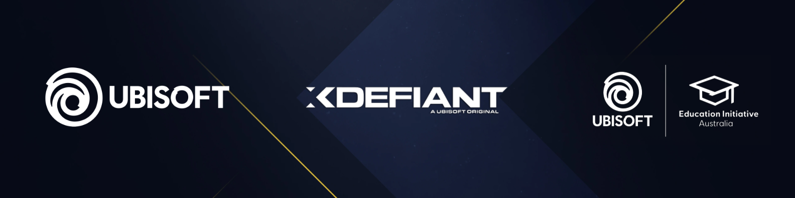

I am a Software Engineer specializing in C++ and Unreal Engine, with a focus on real-time applications and immersive experiences. I provide freelance software engineering, technical consulting, and specialized tuition services for studios, teams, and individuals.

My professional experience spans the games industry, academia, and research. Having worked as a Gameplay Engineer at Ubisoft, contributed to research and government projects, and taught at the tertiary level, I bring a well-rounded perspective that bridges real-world production, technical depth, and education. This allows me not only to build high-quality solutions but also to communicate and mentor effectively.

I bring a flexible engineering mindset that adapts to different domains and challenges. I focus on delivering clean, scalable solutions and practical outcomes, whether that means shipping features, guiding technical direction, or helping others develop their skills.

My services include:

- <b>Software Engineering:</b> Design and implementation of robust, scalable, and performant technical solutions.

- <b>Technical Consulting:</b> Strategic architectural oversight, technical roadmaps, and feasibility studies.

- <b>Specialized Tuition:</b> Professional mentorship, comprehensive code reviews, and industry-focused training.

I am currently available for freelance engagements and remain open to impactful full-time roles.
  

 
  <a href="https://www.linkedin.com/in/peter-hoghton/">LinkedIn</a> | 
  <a href="https://www.youtube.com/@PeterHoghtonDigital">YouTube</a> | 
  <a href="mailto:peterhoghtondigital@gmail.com">Email</a>
    You can support my work via <a href="https://www.paypal.com/paypalme/PeterHoghtonDigital">PayPal</a>.

